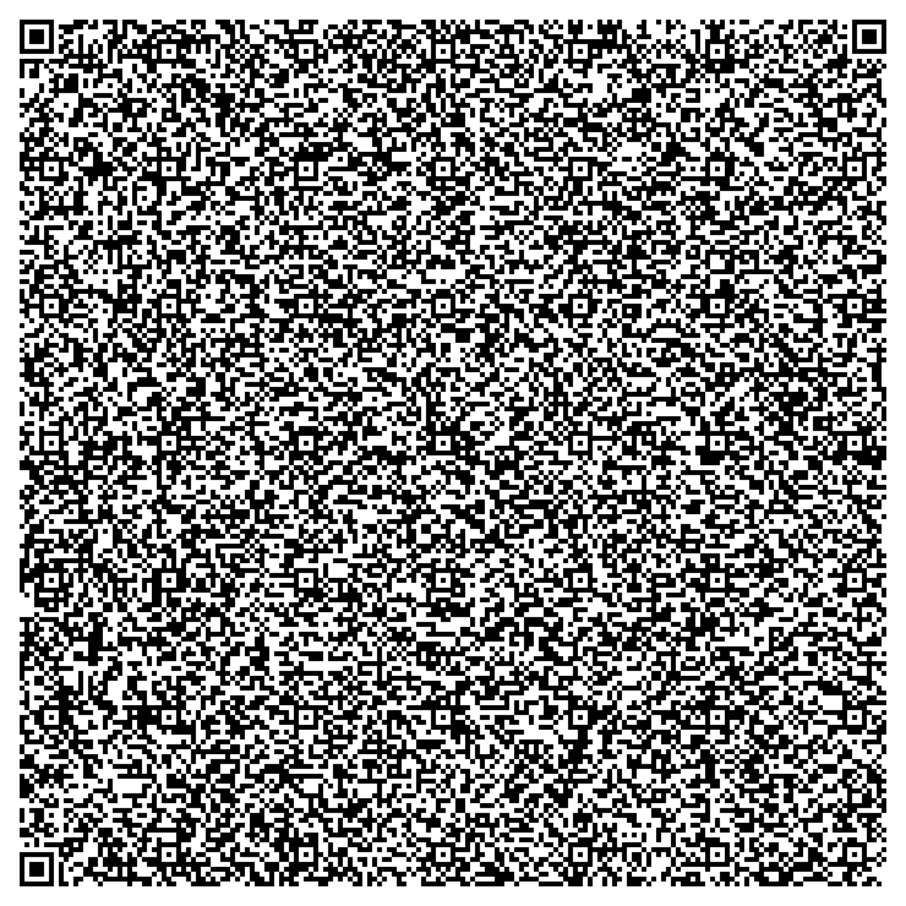

# Agentic QR codes

> ***What is the smallest arrangement of matter and energy from which an agentic process can emerge?***

## Technical Foundation

Standard QR codes offer remarkable data capacity, with Version 40 (177x177) supporting up to 2,953 bytes of raw data with error correction. This capacity enables the embedding of generative interfaces within a single QR code, allowing you to instantly agentize any device or embedded system with a webcam and web browser, even if offline

As demonstrated by Veritassium and others, it's possible to create scannable QR codes by simply arranging matter:

## Implementation Example

<table>
  <thead>
    <tr>
      <th colspan=2><h3>OpenRouter</h3></th>
    </tr>
  </thead>
  <tbody>
    <tr>
      <td>
        <ul>
          <li>Free API keys available https://openrouter.ai</li>
        </ul>
        
      </td>
      <td>
      </td> 
    </tr>    
  </tbody>
</table>

## Development Tools

QR code generation is currently handled through the [Nayuki QR Code Generator Library](https://www.nayuki.io/page/qr-code-generator-library), which provides robust encoding capabilities for various data formats.

## Future Development

The project is evolving to include:
- An advanced editor interface
- Local development options
- Enhanced code generation capabilities

This experimental platform opens new possibilities for creative archiving and distribution, particularly focused on retro and embedded devices operating in offline environments.

## Core Capabilities

The source code is designed to be entirely self-contained within a standard QR code. Most modern devices can read these codes through their default camera app, while any QR code scanner app serves as a fallback option.

**Data Encoding Ranges:**
- Raw byte data: 17 to 2,953 bytes
- Numeric characters: 41 to 7,089 characters
- Alphanumeric: 25 to 4,296 characters

