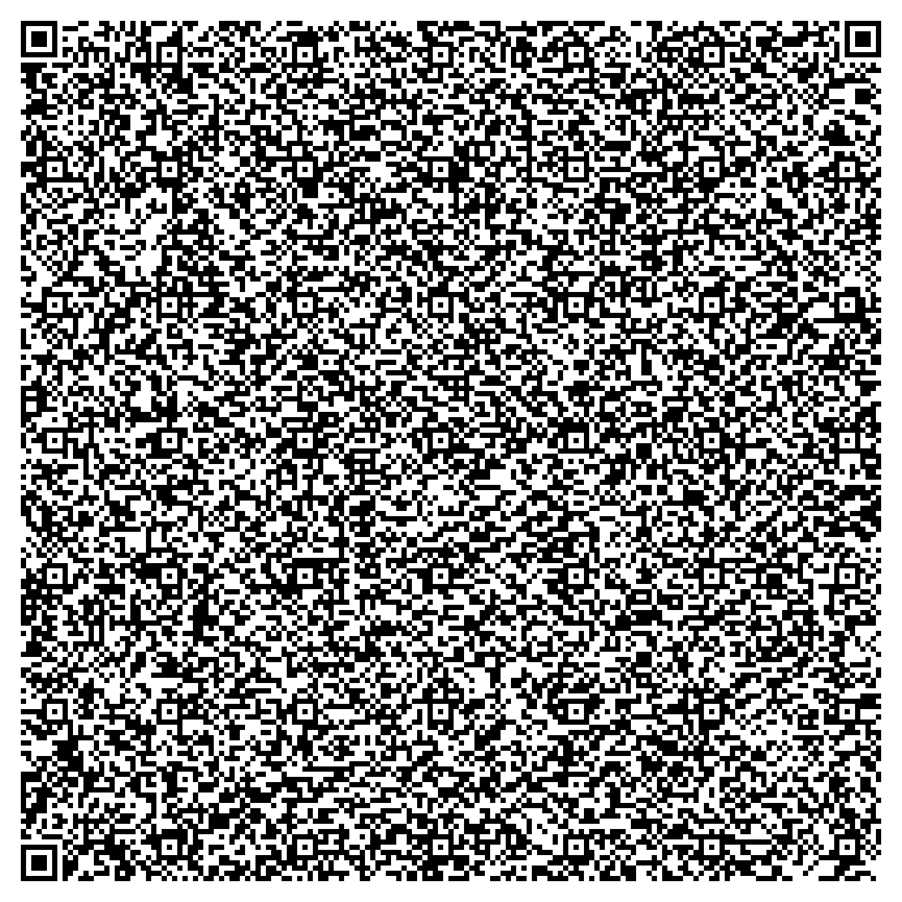
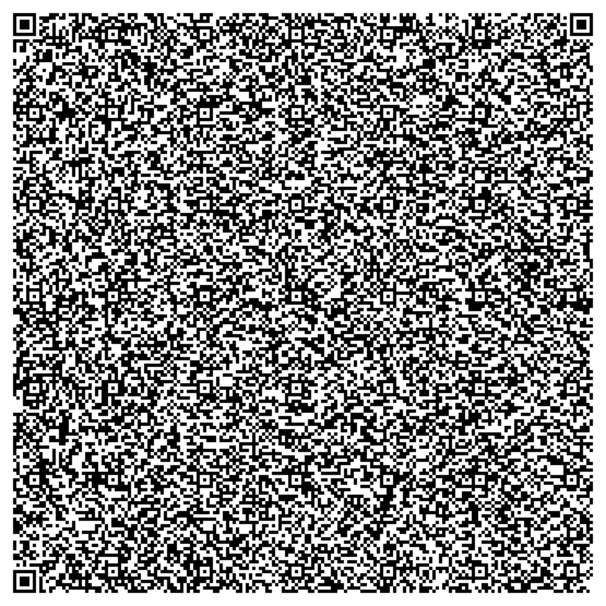

(this is still a draft research project)

## Agentic QR Codes

> ***Research Questions:*** _Is it possible to create a single self-contained QR code that generates a Large Language Model (LLM) simulated Operating System (OS)? Can an LLM OS be used to generate full-dive mixed realities?_

## Technical Foundation

Standard QR codes offer remarkable data capacity, with Version 40 (177x177) supporting up to 2,953 bytes of raw data with error correction. QR codes are ubiquitous and can be scanned from nearly any device. The algorithm is open-sourced and has been encoded across a wide range of creative mediums:

<table>
  <thead>
    <tr>
      <th colspan=2>
        Videos and articles explaining QR codes across different mediums
      </th>
    </tr>
  </thead>
  <tbody>
    <tr>
      <td>
        
      </td>
      <td>
        
      </td>
    </tr>    
  </tbody>
</table>

"Agentic QR codes" are ones that contain all the code necessary to bootstrap an LLM OS. An LLM OS is an Operating System metaphor that imagines AI as the Central Processing Units of generative virtual machines:

<table>
  <thead>
    <tr>
      <th colspan=1>
        Articles explaining LLM OS
      </th>
    </tr>
  </thead>
  <tbody>
    <tr>
      <td>
        
      </td>
    </tr>    
  </tbody>
</table>

## Browser implementation

An LLM OS can be implemented in any language and environment that can communicate with an LLM. This section focuses on using a Web Browser as the host environment because Browsers expose the following:

- External `<scripts>` via CDNs, Github, and local servers
- Sensors like accelerometers, microphones, webcams, MIDI devices, and other input devices
- Networking protocols like Websockets and Bluetooth
- Accessible via mobile devices, smart projectors, and embedded systems

The system reimagines IndexedDB as the filesystem, with a table called `os` where the `window.location #hashstring` is used as the key. The value is rendered by the browser as raw HTML + JavaScript. Each `#hashstring` is displayed in a `textarea` and `iframe`, allowing editing and rendering. The URL itself acts as a prompting interface, enabling LLM edits with a `?prompt` parameter. Opening multiple tabs to the same `#hashstring` keeps them synced, preventing accidental edits and allowing simultaneous viewing and editing.

### Bootstrapping the LLM OS
For convenience, these QR codes all encode the same static HTML file and bootstrapped LLM OS, they just differ in their default LLM API implementation.

- Scan one of the codes
- Copy + paste the string into a `.html` file
- Open that file in a browser

You can also just clone or download the files in this repo and open them in a browser. You only have to manually create the file once, you can extend the LLM OS by simply scanning QR codes into the OS directly

Data is persisted using the browser's IndexedDB API. If you open these files directly, the data will be mapped to that specific filename. Changing the filename would generate a new IndexedDB database (while keeping the old one). For production use, it's recommended to run a server (todo: explain how).

<table>
  <thead>
    <tr>
      <th colspan=1><h3>Local LLMs</h3></th>
      <th colspan=1><h3>Cloud Hosted LLMs</h3></th>
    </tr>
  </thead>
  <tbody>
    <tr>
      <td>
        <h3><a href="https://ollama.sh">Ollama.sh</a></h3>
        
<a href="./ollama.html">Source</a>, <a href="https://recursivefaith.github.io/qrcoding/ollama">Hosted</a>

        
        <ul>
          <li>Default model: <a href="https://ollama.com/library/deepseek-r1:8b">deepseek/deepseek-r1</a>
          <li>Supports vision models</li>
          <li>Don't forget to <a href="https://github.com/ollama/ollama/blob/main/docs/faq.md#how-do-i-configure-ollama-server">enable CORS in Ollama</a></li>
        </ul>
      </td>
      <td>
        <h3><a href="https://openrouter.ai">OpenRouter.ai</a></h3>
        
<a href="./openrouter.html">Source</a>, <a href="https://recursivefaith.github.io/qrcoding/openrouter">Hosted</a>

        
        <ul>
          <li>Default model: <a href="https://openrouter.ai/deepseek/deepseek-r1">deepseek/deepseek-r1</a>
          <li>Supports vision models</li>
          <li>Free API keys available</li>
        </ul>
      </td>
    </tr>    
  </tbody>
</table>

## Development Notes

- To generate these QR Codes
  - I first compress the HTML with https://htmlcompressor.com/compressor
  - I then encode it into a QR code with https://www.nayuki.io/page/qr-code-generator-library
- QR Code limits:
  - Raw byte data: `17 to 2,953 bytes`
  - Numeric characters: `41 to 7,089 characters`
  - Alphanumeric: `25 to 4,296 characters`
